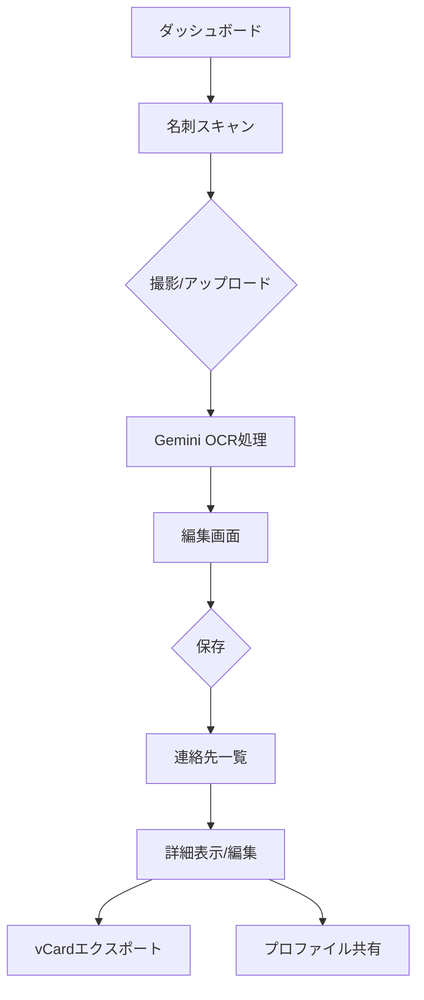

# 📸 名刺スキャナー統合計画書

**作成日**: 2025-09-21
**作成者**: PdM
**対象**: 開発チーム

## 1. エグゼクティブサマリー

名刺スキャナーシステムをNFCプロファイルカードに統合し、ユーザーの連絡先管理機能を強化します。

### 統合後の価値提案
- **ビジネスユーザー向け**: 名刺交換後、即座にデジタル管理
- **エンドユーザー向け**: 連絡先の一元管理
- **差別化要素**: NFCカード × 名刺スキャン × プロファイル共有の統合

## 2. 現状分析

### 名刺スキャナーシステムの構成

```
名刺スキャナー（独立アプリ）
├── フロントエンド
│   ├── React 19 + TypeScript
│   ├── Vite（ビルドツール）
│   └── Tailwind CSS
├── AI/OCR
│   └── Google Gemini 2.5 Flash API
└── 機能
    ├── 画像アップロード/カメラ撮影
    ├── AI自動情報抽出
    ├── 手動編集
    └── vCardダウンロード
```

### NFCプロファイルカード側の現状

```
NFCプロファイルカード（メインアプリ）
├── フロントエンド
│   ├── Next.js 14 + TypeScript
│   ├── Tailwind CSS + shadcn/ui
│   └── React 18
├── バックエンド
│   ├── Firebase Auth
│   ├── Firestore
│   └── Firebase Storage
└── 機能
    ├── プロファイル管理
    ├── VCard生成
    ├── QRコード生成
    └── アナリティクス
```

## 3. 統合アーキテクチャ提案

### Option A: マイクロフロントエンド統合（推奨）

**メリット:**
- 独立開発・デプロイ可能
- 技術スタックの違いを吸収
- 段階的な統合が可能

**実装方法:**
1. 名刺スキャナーを独立コンポーネントとして維持
2. iframeまたはModule Federationで統合
3. Firebase Authでシングルサインオン

### Option B: 完全統合

**メリット:**
- 統一されたUX
- コードベースの一元管理
- パフォーマンス最適化

**実装方法:**
1. Next.jsプロジェクトに移植
2. Gemini APIをAPI Routesに実装
3. 既存のUIコンポーネントライブラリ使用

## 4. 実装計画（Option A推奨）

### Phase 1: 準備（1-2日）

#### タスク1.1: API統合準備
```typescript
// /src/app/api/business-card/scan/route.ts
import { GoogleGenAI } from "@google/genai";

export async function POST(request: Request) {
  // 画像をGeminiに送信
  // 抽出結果をFirestoreに保存
  // レスポンス返却
}
```

#### タスク1.2: データモデル拡張
```typescript
// Firestoreスキーマ
interface ScannedContact {
  id: string;
  userId: string;
  scannedAt: Timestamp;
  contactInfo: {
    lastName: string;
    firstName: string;
    company: string;
    email: string;
    // ... 他のフィールド
  };
  imageUrl?: string; // Firebase Storage
  tags?: string[];
  notes?: string;
}
```

### Phase 2: UI統合（2-3日）

#### タスク2.1: ダッシュボードへの入り口追加
```tsx
// /src/app/dashboard/page.tsx に追加
<div className="bg-white rounded-lg shadow p-6">
  <h2>名刺スキャン</h2>
  <Link href="/dashboard/business-cards/scan">
    <Button>名刺をスキャン</Button>
  </Link>
</div>
```

#### タスク2.2: スキャンページ作成
```tsx
// /src/app/dashboard/business-cards/scan/page.tsx
export default function BusinessCardScanPage() {
  // カメラ/アップロード UI
  // Gemini APIコール
  // 編集フォーム
  // Firestoreへの保存
}
```

### Phase 3: 連絡先管理（2-3日）

#### タスク3.1: 連絡先一覧ページ
```tsx
// /src/app/dashboard/contacts/page.tsx
- スキャンした名刺一覧
- 検索・フィルター機能
- タグ管理
- エクスポート機能
```

#### タスク3.2: 連絡先詳細ページ
```tsx
// /src/app/dashboard/contacts/[id]/page.tsx
- 連絡先情報表示
- 編集機能
- メモ機能
- vCardエクスポート
```

### Phase 4: 高度な機能（3-5日）

#### タスク4.1: 双方向連携
- スキャンした連絡先 → 自分のプロファイルへのリンク共有
- 相手のNFCプロファイルとの連携

#### タスク4.2: AIによる拡張機能
- 重複検出
- LinkedIn/SNS連携提案
- ミーティング履歴との紐付け

## 5. 技術実装詳細

### 環境変数設定
```env
# .env.local に追加
GEMINI_API_KEY=your_gemini_api_key
```

### 必要なパッケージ
```json
{
  "dependencies": {
    "@google/genai": "^1.20.0",
    "react-camera-pro": "^1.3.0" // カメラ機能用
  }
}
```

### セキュリティ考慮事項
- Gemini API KeyはサーバーサイドのみでFCRE
- アップロード画像のサイズ制限（10MB）
- スキャンレート制限（ユーザーあたり50回/日）

## 6. データベース設計

### Firestoreコレクション構造
```
users/
  {userId}/
    scannedContacts/
      {contactId}/
        - contactInfo: {...}
        - scannedAt: timestamp
        - lastUpdated: timestamp
        - tags: []
        - notes: string
        - imageUrl: string
        - linkedProfileId?: string // NFCプロファイルとのリンク
```

## 7. UI/UXフロー



## 8. テスト計画

### 単体テスト
- [ ] Gemini API連携
- [ ] vCard生成
- [ ] Firestore CRUD操作

### 統合テスト
- [ ] 画像アップロード → OCR → 保存フロー
- [ ] 連絡先管理機能
- [ ] エクスポート機能

### E2Eテスト
- [ ] 名刺スキャン完全フロー
- [ ] 複数ユーザー間での連携

## 9. リスクと対策

| リスク | 影響度 | 対策 |
|--------|--------|------|
| Gemini APIコスト | 高 | レート制限、キャッシュ実装 |
| OCR精度 | 中 | 手動編集機能の充実 |
| プライバシー | 高 | 暗号化、アクセス制御 |

## 10. KPI/成功指標

- スキャン成功率: >85%
- OCR精度: >90%
- ユーザー採用率: アクティブユーザーの30%
- 平均スキャン時間: <30秒

## 11. タイムライン

```
Week 1 (9/23-9/27)
├── Phase 1: API統合準備
└── Phase 2: UI統合開始

Week 2 (9/30-10/4)
├── Phase 2: UI統合完了
└── Phase 3: 連絡先管理

Week 3 (10/7-10/11)
├── Phase 4: 高度な機能
└── テスト・バグ修正

Week 4 (10/14-10/18)
└── リリース準備・デプロイ
```

## 12. 必要なリソース

### 開発チーム
- フロントエンド開発者 × 2名
- バックエンド開発者 × 1名
- QAエンジニア × 1名

### 外部リソース
- Gemini API利用料（月額$100想定）
- Firebase Storage追加容量

## 13. 次のステップ

1. **技術検証（〜9/23）**
   - Gemini API動作確認
   - Next.jsでの実装サンプル作成

2. **詳細設計（〜9/25）**
   - UIワイヤーフレーム作成
   - APIエンドポイント設計

3. **開発開始（9/26〜）**
   - Phase 1から順次実装

---

**承認者**: [  ] CTO  [  ] CEO  [  ] デザインリード
**最終更新**: 2025-09-21
